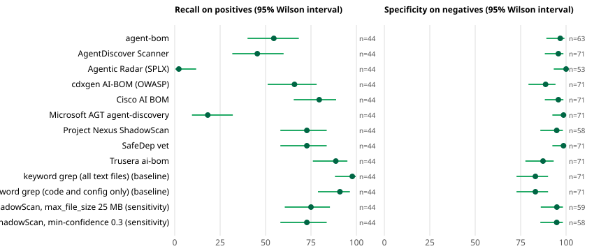

# Real-world Shadow-AI discovery benchmark: results

> **Read this first.** The benchmark was designed and run by an AI agent working in the ShadowScan repository, and ShadowScan is one of the tools scored: it is **not independent**. The ground truth is a deterministic oracle plus language-model adjudication of disagreements, **not human review**. Tools ran **offline** at pinned versions on one dated sample of public GitHub and GitLab repositories, so these numbers are not field precision or recall, and nothing here ranks the tools. Nothing was committed to version control while the benchmark ran, so the order in which things were written is evidenced only by the hash freeze at the end of this report. [PROTOCOL.md](PROTOCOL.md) gives the design, its limits and its changes.

## Findings

**Scope of the evidence.** 326 public repositories (315 usable), 9 tools plus 2 keyword baselines and 2 ShadowScan configuration rows, one offline run on one date. The headline scope is the 115 repositories drawn at random (44 positives, 71 negatives), so every interval is wide: with 44 positives a recall estimate is uncertain by roughly ±10–15 points, and differences smaller than about 20 points are not resolved. Nothing here ranks the tools.

1. **Keyword search matches every tool's recall; the tools differ on false alarms.** The all-text keyword baseline finds 43 of the 44 headline positives (98%); the highest real-tool recalls are Trusera ai-bom 89% and Cisco AI BOM 80%. That is partly built in: a positive is a repository with AI dependencies, imports or agent files, and such repositories mention AI vendors. What separates the tools is how many of the 71 negatives they clear: the baseline 83%; Microsoft AGT and SafeDep vet 99%; agent-bom 97% (of the 63 it scanned); Cisco AI BOM and AgentDiscover 96%; ShadowScan 95% (of the 58 it finished); cdxgen 89%; Trusera 87%.
2. **False alarms have repeatable causes.** Over all 315 usable repositories: Trusera reports CrewAI in 26 of its 40 false alarms; AgentDiscover's DAI005 ("direct HTTP LLM client") is behind all 13 of its false alarms; cdxgen reports an inference service named after Ollama or OpenAI in 25 of its 39; 6 of Cisco AI BOM's 13 are classical-ML or neural-codec repositories where it lists model, dataset and dependency items; 3 of agent-bom's 7 are Jupyter notebooks reported as `jupyter:`/`notebook:` items; ShadowScan's 11 oracle-labelled false alarms include two that are real LLM use the oracle missed (`rw-168` Groq, `rw-143` Ollama over plain HTTP; adjudication confirmed the second), lexical collisions (MCP = Minecraft Coder Pack, CodeX, a user-agent list) and 5 findings of kind `secret`. That kind comes from a generic inline-credential heuristic whose findings are all titled "LLM provider credential": across the 326 repositories 502 of 520 secret findings carry no provider attribution, and a secret-only result is the entire output of 13 of the 21 repositories where ShadowScan reported anything for a repository whose label is negative. These are descriptions of what the tools reported on this sample, not a diagnosis of their rules.
3. **ShadowScan finds almost everything it finishes but does not finish 28% of scans.** Under its defaults 91 of 326 scans end incomplete (exit 3): 64 flagged partial and 27 failed outright. Counted strictly, as the headline does, recall is 73% and specificity 95%; if an incomplete scan that still reports findings is counted as a detection, recall is 100% (44 of 44, and 150 of 153 over all frames) and specificity falls to 89% (and 111 of 136 over all frames), because some false alarms then count. Raising `max_file_size` to 25 MB lowers the incomplete scans only from 91 to 86. A repeat run that classified the diagnostics of the 93 scans that were incomplete in it (table below; only errors and warnings that say coverage is incomplete are counted) found: an analyzable file over the limit in 43 repositories (JSON 17, plain text 7, notebooks 6, YAML 5 and similar; images, lockfiles and archives are skipped without making a scan incomplete), `incomplete source lexical analysis` in 27, a submodule that the snapshot did not materialise in 17 (a condition the benchmark's fetcher created), binary or undecodable content in a source file in 17, and an unavailable symlink target in 16. Skipped build or vendor directories do not make a scan incomplete. This is the fail-closed contract working as written; whether it is too strict for repository scanning is a product decision, and the report shows both readings side by side rather than choosing one. The benchmark's author is also ShadowScan's developer, which is a reason to read this item with more care than the others.
4. **The strict policy can only penalise tools that say a scan was incomplete.** ShadowScan, Cisco AI BOM and agent-bom do; the other tools' incomplete scans are invisible to the harness. agent-bom's own verdict is "partial" on 81 of 326 scans (25%: it stops its AST pass at 500 files and its secret scan at 1,000), which takes its strict headline recall to 55% against 84% when partial scans are kept. Read the strict headline beside the "partial scans kept" columns.
5. **Agentic Radar needs to be told the framework and crashes on real code.** Its CrewAI or n8n scanner raised an exception on 158 of 326 repositories (48%; `AttributeError` in the cases examined) and it detected 1 of 44 headline positives; it is built to analyse known LangGraph, CrewAI, n8n, OpenAI Agents and AutoGen projects, not to discover unknown ones.
6. **Developer-tooling configuration is the hard case.** 42 of the 153 positives have only AGENTS.md, CLAUDE.md, `.mcp.json`, skills or similar. Recall on them: Cisco AI BOM 71%, ShadowScan 69%, SafeDep vet 55%, cdxgen 55%, Trusera 43%, agent-bom 26%, AgentDiscover 12%, AGT 2%. AGT's file-name scanner finds `mcp.json`-style files by design (18% overall, 99% specificity). The keyword baseline reaches 83% on these, because those files name the vendors in plain text.
7. **Two positives were missed by every tool.** Both are MCP servers written without an official SDK (`rw-148`, `rw-200`): a raw `tools/list` handler and a directory manifest. All tools lean on SDK imports. The union of the nine real tools finds 99% (151 of 153).
8. **The ground truth had blind spots, and adjudication found them.** Of the 70 negatives that at least one tool flagged, blinded model adjudicators ruled 6 to be real AI use (for example `rw-017` mcpulse, `rw-132` born); all 12 positives that most tools missed were confirmed; none of 23 randomly sampled cases where everyone agreed changed; and all 4 ambiguous repositories were ruled AI use. The two adjudicators agreed on every decided card (kappa 1.0), which for two runs of one model family on identical cards is a consistency check, not independent confirmation. A seventh case, `rw-168` (a Streamlit app that does `from groq import Groq`, flagged by five tools), was ruled "no" because the evidence card's keyword list lacked Groq; I corrected that row by hand after reading the file, and the row carries a note saying so. The same gap could hide other misses on cards where a tool found the only evidence; I checked the negatives that three or more tools flagged against the names the tools reported (and, for the one doubtful repository, its code) and found no other case, but the cards were not re-run and a thorough check would read every flagged negative. The oracle itself also missed `rw-168`, so the headline (oracle-labelled) figures count the five tools' detection of it as false alarms. After adjudication headline figures move by at most 4 points.
9. **The oracle-favours-ShadowScan check is inconclusive by construction.** 149 of 153 positives rest on technologies that at least one other tool's source also mentions, so removing the rest changes little, but that measures vocabulary overlap, not detection, and cannot show independence.
10. **Timeouts and load.** The scored run used 8 workers on 4 CPUs. The 20 pairs that timed out (9 Cisco AI BOM, 10 SafeDep vet, 1 agent-bom) were re-run alone (2 workers). 11 completed: 8 of 10 vet scans, 3 of 9 Cisco scans and 0 of 1 agent-bom scan. Vet's recall rose from 32 to 33 of 44 and its two positive-side errors disappeared; Cisco's and agent-bom's headline figures did not change, so for them the timeouts look tied to the repositories rather than to load. The headline remains the first run.

## Corpus

| Class | Positive | Negative | Ambiguous | AI library |
|---|---|---|---|---|
| probability | 44 | 71 | 0 | 1 |
| search | 40 | 31 | 0 | 1 |
| list | 62 | 22 | 3 | 3 |
| challenge | 7 | 38 | 1 | 0 |

Primary set: 315 repositories (153 positive, 162 negative). Removed because the ShadowScan repository names them: rw-111, rw-121.

Among the 153 positives: 144 involve an agent-type artifact (framework, MCP, coding-agent configuration), 9 are LLM-SDK use only, 111 have application-level evidence, 42 have only developer-tooling configuration (AGENTS.md, CLAUDE.md, .mcp.json and similar), 4 rest on a declared dependency alone.

## Tools and how they were run

| Tool | Source | Pinned commit or version | What was run (offline, no LLM) |
|---|---|---|---|
| agent-bom | msaad00/agent-bom | `26ed7c15841f` | scan <checkout> --ai-inventory --no-scan --offline (inventory only) |
| AgentDiscover Scanner | Defend-AI-Tech-Inc/agent-discover-scanner | `a3756cda779a` | scan --format sarif + audit --skip-layers 2,3,4,5 |
| Agentic Radar (SPLX) | splx-ai/agentic-radar | `65a7e4bd01e2` | scan <framework> for langgraph, crewai, n8n, openai-agents, autogen (static analysis) |
| cdxgen AI-BOM (OWASP) | cdxgen/cdxgen | `npm 12.8.5` | aibom --no-install-deps (models, inference services, prompts, MCP configuration) |
| Cisco AI BOM | cisco-ai-defense/aibom | `8d7bec099d5d` | analyze <checkout>; LLM classifier unreachable (deterministic candidates only) |
| Microsoft AGT agent-discovery | microsoft/agent-governance-toolkit | `431d20b2fe23` | scan -s config (file-name based); process and github scanners not applicable offline |
| Project Nexus ShadowScan | aisecnomad/Project-Nexus | `451dd805b302` | code.filesystem on the checkout (signature packs for frameworks, providers, MCP and coding agents) |
| SafeDep vet | safedep/vet | `948d9bafaf80` | ai discover --scope project + code scan (xBOM signatures tagged ai/llm/agent/mcp/crewai) |
| Trusera ai-bom | Trusera/ai-bom | `012d53d389ca` | scan <checkout> -f json (default depth) |
| keyword grep (all text files) *(baseline)* | baseline | - | case-insensitive vendor and framework names in any text file |
| keyword grep (code and config only) *(baseline)* | baseline | - | same pattern, prose and lock files excluded |
| ShadowScan, max_file_size 25 MB *(sensitivity row)* | aisecnomad/Project-Nexus | `451dd805b302` | as shadowscan, with max_file_size 25 MB and connector deadline 540 s |
| ShadowScan, min-confidence 0.3 *(sensitivity row)* | aisecnomad/Project-Nexus | `451dd805b302` | as shadowscan, with --min-confidence 0.3 |

## Headline: random-draw frames only

The `probability` class (`pypi-ai`, `pypi-other`, `go-ai`, `go-random`, `gitlab-random`) is the only scope that is a random draw from a defined frame. Recall is measured on that frame's positives (many from `pypi-ai`, whose positives are Python projects declaring a known AI package) and specificity on its negatives. A scan the tool itself calls incomplete counts as an error: a miss on a positive, outside the denominator on a negative. Rows are in alphabetical order; no row is better than another by position.

| Tool | Recall on positives | Specificity on negatives | Errors (all repos) | Incomplete scans | Median time |
|---|---|---|---|---|---|
| agent-bom | 24/44 = 55% [40%-68%] | 61/63 = 97% [89%-99%] | 4% | 81 | 6 s |
| AgentDiscover Scanner | 20/44 = 45% [32%-60%] | 68/71 = 96% [88%-99%] | 0% | 0 | 6 s |
| Agentic Radar (SPLX) | 1/44 = 2% [0%-12%] | 53/53 = 100% [93%-100%] | 48% | 0 | 14 s |
| cdxgen AI-BOM (OWASP) | 29/44 = 66% [51%-78%] | 63/71 = 89% [79%-94%] | 0% | 0 | 4 s |
| Cisco AI BOM | 35/44 = 80% [65%-89%] | 68/71 = 96% [88%-99%] | 3% | 0 | 45 s |
| Microsoft AGT agent-discovery | 8/44 = 18% [10%-32%] | 70/71 = 99% [92%-100%] | 0% | 0 | 1 s |
| Project Nexus ShadowScan | 32/44 = 73% [58%-84%] | 55/58 = 95% [86%-98%] | 8% | 64 | 4 s |
| SafeDep vet | 32/44 = 73% [58%-84%] | 70/71 = 99% [92%-100%] | 3% | 0 | 7 s |
| Trusera ai-bom | 39/44 = 89% [76%-95%] | 62/71 = 87% [78%-93%] | 0% | 0 | 2 s |
| keyword grep (all text files) *(baseline)* | 43/44 = 98% [88%-100%] | 59/71 = 83% [73%-90%] | 0% | 0 | 1 s |
| keyword grep (code and config only) *(baseline)* | 40/44 = 91% [79%-96%] | 59/71 = 83% [73%-90%] | 0% | 0 | 0 s |
| ShadowScan, max_file_size 25 MB *(sensitivity row)* | 33/44 = 75% [61%-85%] | 56/59 = 95% [86%-98%] | 7% | 63 | 4 s |
| ShadowScan, min-confidence 0.3 *(sensitivity row)* | 32/44 = 73% [58%-84%] | 55/58 = 95% [86%-98%] | 9% | 63 | 3 s |

Of the 44 positives in this scope, 34 come from `pypi-ai` and `go-ai`, strata chosen because the project declares an AI package or has an AI-like name. Recall here is therefore mostly recall on AI-enriched strata; the untargeted frames (`pypi-other`, `go-random`, `gitlab-random`) hold 10 positives.

**Incomplete scans.** Only ShadowScan, Cisco AI BOM and agent-bom say, in a form the harness can read, that a scan was incomplete. For the other tools an incomplete scan cannot be told from a complete one, so the strict headline policy can only penalise the three that disclose it. Read the headline beside the "partial scans kept" columns of the error-policy table below, and do not read a higher strict number as a more complete scan.

## Recall and specificity by class and frame

`search`, `list` and `challenge` frames are not random draws and are shown separately, never pooled into the headline.

Recall:

| Tool | probability | search | list | challenge |
|---|---|---|---|---|
| agent-bom | 24/44 = 55% [40%-68%] | 15/40 = 38% [24%-53%] | 29/62 = 47% [35%-59%] | 1/7 = 14% [3%-51%] |
| AgentDiscover Scanner | 20/44 = 45% [32%-60%] | 17/40 = 42% [29%-58%] | 25/62 = 40% [29%-53%] | 4/7 = 57% [25%-84%] |
| Agentic Radar (SPLX) | 1/44 = 2% [0%-12%] | 1/40 = 2% [0%-13%] | 2/62 = 3% [1%-11%] | 0/7 = 0% [0%-35%] |
| cdxgen AI-BOM (OWASP) | 29/44 = 66% [51%-78%] | 29/40 = 72% [57%-84%] | 44/62 = 71% [59%-81%] | 5/7 = 71% [36%-92%] |
| Cisco AI BOM | 35/44 = 80% [65%-89%] | 31/40 = 78% [62%-88%] | 54/62 = 87% [77%-93%] | 6/7 = 86% [49%-97%] |
| Microsoft AGT agent-discovery | 8/44 = 18% [10%-32%] | 9/40 = 22% [12%-38%] | 13/62 = 21% [13%-33%] | 1/7 = 14% [3%-51%] |
| Project Nexus ShadowScan | 32/44 = 73% [58%-84%] | 25/40 = 62% [47%-76%] | 44/62 = 71% [59%-81%] | 2/7 = 29% [8%-64%] |
| SafeDep vet | 32/44 = 73% [58%-84%] | 24/40 = 60% [45%-74%] | 47/62 = 76% [64%-85%] | 4/7 = 57% [25%-84%] |
| Trusera ai-bom | 39/44 = 89% [76%-95%] | 28/40 = 70% [55%-82%] | 40/62 = 65% [52%-75%] | 5/7 = 71% [36%-92%] |
| keyword grep (all text files) *(baseline)* | 43/44 = 98% [88%-100%] | 38/40 = 95% [83%-99%] | 59/62 = 95% [87%-98%] | 6/7 = 86% [49%-97%] |
| keyword grep (code and config only) *(baseline)* | 40/44 = 91% [79%-96%] | 37/40 = 92% [80%-97%] | 57/62 = 92% [82%-97%] | 6/7 = 86% [49%-97%] |
| ShadowScan, max_file_size 25 MB *(sensitivity row)* | 33/44 = 75% [61%-85%] | 25/40 = 62% [47%-76%] | 45/62 = 73% [60%-82%] | 2/7 = 29% [8%-64%] |
| ShadowScan, min-confidence 0.3 *(sensitivity row)* | 32/44 = 73% [58%-84%] | 25/40 = 62% [47%-76%] | 44/62 = 71% [59%-81%] | 2/7 = 29% [8%-64%] |

Specificity:

| Tool | probability | search | list | challenge |
|---|---|---|---|---|
| agent-bom | 61/63 = 97% [89%-99%] | 20/21 = 95% [77%-99%] | 20/21 = 95% [77%-99%] | 24/27 = 89% [72%-96%] |
| AgentDiscover Scanner | 68/71 = 96% [88%-99%] | 30/31 = 97% [84%-99%] | 20/22 = 91% [72%-97%] | 31/38 = 82% [67%-91%] |
| Agentic Radar (SPLX) | 53/53 = 100% [93%-100%] | 16/16 = 100% [81%-100%] | 17/17 = 100% [82%-100%] | 15/15 = 100% [80%-100%] |
| cdxgen AI-BOM (OWASP) | 63/71 = 89% [79%-94%] | 22/31 = 71% [53%-84%] | 18/22 = 82% [61%-93%] | 20/38 = 53% [37%-68%] |
| Cisco AI BOM | 68/71 = 96% [88%-99%] | 30/31 = 97% [84%-99%] | 20/22 = 91% [72%-97%] | 30/37 = 81% [66%-91%] |
| Microsoft AGT agent-discovery | 70/71 = 99% [92%-100%] | 31/31 = 100% [89%-100%] | 22/22 = 100% [85%-100%] | 37/38 = 97% [87%-100%] |
| Project Nexus ShadowScan | 55/58 = 95% [86%-98%] | 22/24 = 92% [74%-98%] | 19/20 = 95% [76%-99%] | 15/20 = 75% [53%-89%] |
| SafeDep vet | 70/71 = 99% [92%-100%] | 31/31 = 100% [89%-100%] | 22/22 = 100% [85%-100%] | 38/38 = 100% [91%-100%] |
| Trusera ai-bom | 62/71 = 87% [78%-93%] | 22/31 = 71% [53%-84%] | 16/22 = 73% [52%-87%] | 22/38 = 58% [42%-72%] |
| keyword grep (all text files) *(baseline)* | 59/71 = 83% [73%-90%] | 22/31 = 71% [53%-84%] | 19/22 = 86% [67%-95%] | 14/38 = 37% [23%-53%] |
| keyword grep (code and config only) *(baseline)* | 59/71 = 83% [73%-90%] | 25/31 = 81% [64%-91%] | 20/22 = 91% [72%-97%] | 19/38 = 50% [35%-65%] |
| ShadowScan, max_file_size 25 MB *(sensitivity row)* | 56/59 = 95% [86%-98%] | 22/24 = 92% [74%-98%] | 19/20 = 95% [76%-99%] | 17/22 = 77% [57%-90%] |
| ShadowScan, min-confidence 0.3 *(sensitivity row)* | 55/58 = 95% [86%-98%] | 22/24 = 92% [74%-98%] | 19/20 = 95% [76%-99%] | 15/20 = 75% [53%-89%] |

Recall by frame (positives found / positives):

| Tool | gitlab-random | go-ai | go-random | pypi-ai | pypi-other | gitlab-ai | npm-ai | npm-other | list-agents | list-claude-code | list-mcp | list-ordinary | classical-ml | hard-negative | prose-only |
|---|---|---|---|---|---|---|---|---|---|---|---|---|---|---|---|
| agent-bom | 0/1 | 8/10 | 1/5 | 13/24 | 2/4 | 5/15 | 10/23 | 0/2 | 6/15 | 7/19 | 16/20 | 0/8 | 0/2 | 1/3 | 0/2 |
| AgentDiscover Scanner | 0/1 | 5/10 | 0/5 | 13/24 | 2/4 | 4/15 | 13/23 | 0/2 | 13/15 | 4/19 | 8/20 | 0/8 | 2/2 | 1/3 | 1/2 |
| Agentic Radar (SPLX) | 0/1 | 1/10 | 0/5 | 0/24 | 0/4 | 0/15 | 1/23 | 0/2 | 1/15 | 0/19 | 1/20 | 0/8 | 0/2 | 0/3 | 0/2 |
| cdxgen AI-BOM (OWASP) | 1/1 | 4/10 | 4/5 | 18/24 | 2/4 | 9/15 | 20/23 | 0/2 | 13/15 | 15/19 | 11/20 | 5/8 | 2/2 | 1/3 | 2/2 |
| Cisco AI BOM | 1/1 | 7/10 | 5/5 | 19/24 | 3/4 | 9/15 | 20/23 | 2/2 | 14/15 | 14/19 | 18/20 | 8/8 | 1/2 | 3/3 | 2/2 |
| Microsoft AGT agent-discovery | 0/1 | 1/10 | 1/5 | 5/24 | 1/4 | 0/15 | 9/23 | 0/2 | 1/15 | 3/19 | 9/20 | 0/8 | 0/2 | 0/3 | 1/2 |
| Project Nexus ShadowScan | 0/1 | 9/10 | 0/5 | 21/24 | 2/4 | 11/15 | 12/23 | 2/2 | 10/15 | 15/19 | 16/20 | 3/8 | 1/2 | 1/3 | 0/2 |
| SafeDep vet | 1/1 | 7/10 | 2/5 | 18/24 | 4/4 | 7/15 | 17/23 | 0/2 | 13/15 | 15/19 | 15/20 | 4/8 | 1/2 | 1/3 | 2/2 |
| Trusera ai-bom | 1/1 | 8/10 | 4/5 | 24/24 | 2/4 | 5/15 | 23/23 | 0/2 | 15/15 | 10/19 | 10/20 | 5/8 | 2/2 | 2/3 | 1/2 |
| keyword grep (all text files) | 1/1 | 10/10 | 4/5 | 24/24 | 4/4 | 14/15 | 23/23 | 1/2 | 15/15 | 19/19 | 20/20 | 5/8 | 1/2 | 3/3 | 2/2 |
| keyword grep (code and config only) | 0/1 | 9/10 | 3/5 | 24/24 | 4/4 | 14/15 | 23/23 | 0/2 | 15/15 | 18/19 | 20/20 | 4/8 | 1/2 | 3/3 | 2/2 |

Specificity by frame (negatives cleared / negatives):

| Tool | gitlab-random | go-ai | go-random | pypi-ai | pypi-other | gitlab-ai | npm-ai | npm-other | list-agents | list-claude-code | list-mcp | list-ordinary | classical-ml | hard-negative | prose-only |
|---|---|---|---|---|---|---|---|---|---|---|---|---|---|---|---|
| agent-bom | 24/25 | - | 16/16 | 1/1 | 20/21 | 3/4 | 1/1 | 16/16 | - | - | - | 20/21 | 5/7 | 13/14 | 6/6 |
| AgentDiscover Scanner | 28/29 | 1/1 | 18/18 | 1/1 | 20/22 | 4/5 | 2/2 | 24/24 | - | - | - | 20/22 | 9/12 | 16/20 | 6/6 |
| Agentic Radar (SPLX) | 23/23 | - | 17/17 | - | 13/13 | 2/2 | 1/1 | 13/13 | - | - | - | 17/17 | - | 10/10 | 5/5 |
| cdxgen AI-BOM (OWASP) | 26/29 | 0/1 | 17/18 | 0/1 | 20/22 | 3/5 | 0/2 | 19/24 | - | - | - | 18/22 | 1/12 | 13/20 | 6/6 |
| Cisco AI BOM | 27/29 | 1/1 | 17/18 | 1/1 | 22/22 | 5/5 | 2/2 | 23/24 | - | - | - | 20/22 | 7/12 | 17/19 | 6/6 |
| Microsoft AGT agent-discovery | 28/29 | 1/1 | 18/18 | 1/1 | 22/22 | 5/5 | 2/2 | 24/24 | - | - | - | 22/22 | 12/12 | 19/20 | 6/6 |
| Project Nexus ShadowScan | 20/21 | - | 14/15 | 1/1 | 20/21 | 2/4 | 1/1 | 19/19 | - | - | - | 19/20 | 2/3 | 7/11 | 6/6 |
| SafeDep vet | 28/29 | 1/1 | 18/18 | 1/1 | 22/22 | 5/5 | 2/2 | 24/24 | - | - | - | 22/22 | 12/12 | 20/20 | 6/6 |
| Trusera ai-bom | 26/29 | 0/1 | 14/18 | 1/1 | 21/22 | 3/5 | 1/2 | 18/24 | - | - | - | 16/22 | 6/12 | 11/20 | 5/6 |
| keyword grep (all text files) | 22/29 | 1/1 | 14/18 | 0/1 | 22/22 | 2/5 | 0/2 | 20/24 | - | - | - | 19/22 | 3/12 | 9/20 | 2/6 |
| keyword grep (code and config only) | 22/29 | 1/1 | 14/18 | 0/1 | 22/22 | 3/5 | 1/2 | 21/24 | - | - | - | 20/22 | 5/12 | 10/20 | 4/6 |

## Sensitivity to the error policy (random-draw frames)

| Tool | Recall (headline) | Recall, partial scans kept | Specificity (headline) | Specificity, partial scans kept | Specificity, errors as clean |
|---|---|---|---|---|---|
| agent-bom | 24/44 = 55% [40%-68%] | 37/44 = 84% [71%-92%] | 61/63 = 97% [89%-99%] | 67/70 = 96% [88%-99%] | 69/71 = 97% [90%-99%] |
| AgentDiscover Scanner | 20/44 = 45% [32%-60%] | 20/44 = 45% [32%-60%] | 68/71 = 96% [88%-99%] | 68/71 = 96% [88%-99%] | 68/71 = 96% [88%-99%] |
| Agentic Radar (SPLX) | 1/44 = 2% [0%-12%] | 1/44 = 2% [0%-12%] | 53/53 = 100% [93%-100%] | 53/53 = 100% [93%-100%] | 71/71 = 100% [95%-100%] |
| cdxgen AI-BOM (OWASP) | 29/44 = 66% [51%-78%] | 29/44 = 66% [51%-78%] | 63/71 = 89% [79%-94%] | 63/71 = 89% [79%-94%] | 63/71 = 89% [79%-94%] |
| Cisco AI BOM | 35/44 = 80% [65%-89%] | 35/44 = 80% [65%-89%] | 68/71 = 96% [88%-99%] | 68/71 = 96% [88%-99%] | 68/71 = 96% [88%-99%] |
| Microsoft AGT agent-discovery | 8/44 = 18% [10%-32%] | 8/44 = 18% [10%-32%] | 70/71 = 99% [92%-100%] | 70/71 = 99% [92%-100%] | 70/71 = 99% [92%-100%] |
| Project Nexus ShadowScan | 32/44 = 73% [58%-84%] | 44/44 = 100% [92%-100%] | 55/58 = 95% [86%-98%] | 55/62 = 89% [78%-94%] | 68/71 = 96% [88%-99%] |
| SafeDep vet | 32/44 = 73% [58%-84%] | 32/44 = 73% [58%-84%] | 70/71 = 99% [92%-100%] | 70/71 = 99% [92%-100%] | 70/71 = 99% [92%-100%] |
| Trusera ai-bom | 39/44 = 89% [76%-95%] | 39/44 = 89% [76%-95%] | 62/71 = 87% [78%-93%] | 62/71 = 87% [78%-93%] | 62/71 = 87% [78%-93%] |
| keyword grep (all text files) *(baseline)* | 43/44 = 98% [88%-100%] | 43/44 = 98% [88%-100%] | 59/71 = 83% [73%-90%] | 59/71 = 83% [73%-90%] | 59/71 = 83% [73%-90%] |
| keyword grep (code and config only) *(baseline)* | 40/44 = 91% [79%-96%] | 40/44 = 91% [79%-96%] | 59/71 = 83% [73%-90%] | 59/71 = 83% [73%-90%] | 59/71 = 83% [73%-90%] |
| ShadowScan, max_file_size 25 MB *(sensitivity row)* | 33/44 = 75% [61%-85%] | 44/44 = 100% [92%-100%] | 56/59 = 95% [86%-98%] | 56/63 = 89% [79%-95%] | 68/71 = 96% [88%-99%] |
| ShadowScan, min-confidence 0.3 *(sensitivity row)* | 32/44 = 73% [58%-84%] | 44/44 = 100% [92%-100%] | 55/58 = 95% [86%-98%] | 55/62 = 89% [78%-94%] | 68/71 = 96% [88%-99%] |

Agentic Radar scans five framework scanners and reports a repository as ok when one of them finds something even if another crashed (5 such repositories). Counting those as incomplete:

| Agentic Radar reading | Recall | Specificity |
|---|---|---|
| headline (a crash elsewhere is ignored once something is found) | 1/44 = 2% [0%-12%] | 53/53 = 100% [93%-100%] |
| a crashed framework scanner makes the scan an error | 0/44 = 0% [0%-8%] | 53/53 = 100% [93%-100%] |

## Sensitivity to the detection rule (random-draw frames)

Each tool's headline rule leaves out what its own taxonomy files under classical ML or says is not an independent signal; the variants count everything.

| Tool | Detection rule | Recall | Specificity |
|---|---|---|---|
| agent-bom | *headline rule* | 24/44 = 55% [40%-68%] | 61/63 = 97% [89%-99%] |
| agent-bom | `any_component` | 24/44 = 55% [40%-68%] | 60/63 = 95% [87%-98%] |
| AgentDiscover Scanner | *headline rule* | 20/44 = 45% [32%-60%] | 68/71 = 96% [88%-99%] |
| AgentDiscover Scanner | `any_rule` | 25/44 = 57% [42%-70%] | 66/71 = 93% [85%-97%] |
| AgentDiscover Scanner | `audit_only` | 20/44 = 45% [32%-60%] | 68/71 = 96% [88%-99%] |
| AgentDiscover Scanner | `scan_only` | 19/44 = 43% [30%-58%] | 68/71 = 96% [88%-99%] |
| cdxgen AI-BOM (OWASP) | *headline rule* | 29/44 = 66% [51%-78%] | 63/71 = 89% [79%-94%] |
| cdxgen AI-BOM (OWASP) | `with_file_heuristics` | 39/44 = 89% [76%-95%] | 45/71 = 63% [52%-74%] |
| Cisco AI BOM | *headline rule* | 35/44 = 80% [65%-89%] | 68/71 = 96% [88%-99%] |
| Cisco AI BOM | `any_component` | 36/44 = 82% [68%-90%] | 64/71 = 90% [81%-95%] |
| SafeDep vet | *headline rule* | 32/44 = 73% [58%-84%] | 70/71 = 99% [92%-100%] |
| SafeDep vet | `code_only` | 23/44 = 52% [38%-66%] | 70/71 = 99% [92%-100%] |
| SafeDep vet | `discover_only` | 21/44 = 48% [34%-62%] | 71/71 = 100% [95%-100%] |

## Sensitivity to the label definition (all frames pooled, descriptive)

| Tool (recall specificity) | app-only | core | loose | no-dep-only | shared-vocab | strict | with-libraries |
|---|---|---|---|---|---|---|---|
| agent-bom | 58/111 = 52% [43%-61%] 125/132 = 95% [89%-97%] | 67/151 = 44% [37%-52%] 125/132 = 95% [89%-97%] | 69/154 = 45% [37%-53%] 125/132 = 95% [89%-97%] | 65/149 = 44% [36%-52%] 125/132 = 95% [89%-97%] | 68/149 = 46% [38%-54%] 125/132 = 95% [89%-97%] | 69/153 = 45% [37%-53%] 125/132 = 95% [89%-97%] | 71/158 = 45% [37%-53%] 125/132 = 95% [89%-97%] |
| AgentDiscover Scanner | 61/111 = 55% [46%-64%] 149/162 = 92% [87%-95%] | 64/151 = 42% [35%-50%] 149/162 = 92% [87%-95%] | 66/154 = 43% [35%-51%] 149/162 = 92% [87%-95%] | 64/149 = 43% [35%-51%] 149/162 = 92% [87%-95%] | 65/149 = 44% [36%-52%] 149/162 = 92% [87%-95%] | 66/153 = 43% [36%-51%] 149/162 = 92% [87%-95%] | 70/158 = 44% [37%-52%] 149/162 = 92% [87%-95%] |
| Agentic Radar (SPLX) | 4/111 = 4% [1%-9%] 101/101 = 100% [96%-100%] | 4/151 = 3% [1%-7%] 101/101 = 100% [96%-100%] | 4/154 = 3% [1%-6%] 101/101 = 100% [96%-100%] | 4/149 = 3% [1%-7%] 101/101 = 100% [96%-100%] | 4/149 = 3% [1%-7%] 101/101 = 100% [96%-100%] | 4/153 = 3% [1%-7%] 101/101 = 100% [96%-100%] | 5/158 = 3% [1%-7%] 101/101 = 100% [96%-100%] |
| cdxgen AI-BOM (OWASP) | 84/111 = 76% [67%-83%] 123/162 = 76% [69%-82%] | 106/151 = 70% [62%-77%] 123/162 = 76% [69%-82%] | 108/154 = 70% [62%-77%] 123/162 = 76% [69%-82%] | 104/149 = 70% [62%-77%] 123/162 = 76% [69%-82%] | 105/149 = 70% [63%-77%] 123/162 = 76% [69%-82%] | 107/153 = 70% [62%-77%] 123/162 = 76% [69%-82%] | 112/158 = 71% [63%-77%] 123/162 = 76% [69%-82%] |
| Cisco AI BOM | 96/111 = 86% [79%-92%] 148/161 = 92% [87%-95%] | 124/151 = 82% [75%-87%] 148/161 = 92% [87%-95%] | 127/154 = 82% [76%-88%] 148/161 = 92% [87%-95%] | 122/149 = 82% [75%-87%] 148/161 = 92% [87%-95%] | 125/149 = 84% [77%-89%] 148/161 = 92% [87%-95%] | 126/153 = 82% [76%-88%] 148/161 = 92% [87%-95%] | 131/158 = 83% [76%-88%] 148/161 = 92% [87%-95%] |
| Microsoft AGT agent-discovery | 30/111 = 27% [20%-36%] 160/162 = 99% [96%-100%] | 31/151 = 21% [15%-28%] 160/162 = 99% [96%-100%] | 31/154 = 20% [15%-27%] 160/162 = 99% [96%-100%] | 31/149 = 21% [15%-28%] 160/162 = 99% [96%-100%] | 31/149 = 21% [15%-28%] 160/162 = 99% [96%-100%] | 31/153 = 20% [15%-27%] 160/162 = 99% [96%-100%] | 32/158 = 20% [15%-27%] 160/162 = 99% [96%-100%] |
| Project Nexus ShadowScan | 74/111 = 67% [57%-75%] 111/122 = 91% [85%-95%] | 101/151 = 67% [59%-74%] 111/122 = 91% [85%-95%] | 104/154 = 68% [60%-74%] 111/122 = 91% [85%-95%] | 99/149 = 66% [59%-74%] 111/122 = 91% [85%-95%] | 101/149 = 68% [60%-75%] 111/122 = 91% [85%-95%] | 103/153 = 67% [60%-74%] 111/122 = 91% [85%-95%] | 104/158 = 66% [58%-73%] 111/122 = 91% [85%-95%] |
| SafeDep vet | 84/111 = 76% [67%-83%] 161/162 = 99% [97%-100%] | 106/151 = 70% [62%-77%] 161/162 = 99% [97%-100%] | 107/154 = 69% [62%-76%] 161/162 = 99% [97%-100%] | 104/149 = 70% [62%-77%] 161/162 = 99% [97%-100%] | 107/149 = 72% [64%-78%] 161/162 = 99% [97%-100%] | 107/153 = 70% [62%-77%] 161/162 = 99% [97%-100%] | 110/158 = 70% [62%-76%] 161/162 = 99% [97%-100%] |
| Trusera ai-bom | 94/111 = 85% [77%-90%] 122/162 = 75% [68%-81%] | 110/151 = 73% [65%-79%] 122/162 = 75% [68%-81%] | 112/154 = 73% [65%-79%] 122/162 = 75% [68%-81%] | 108/149 = 72% [65%-79%] 122/162 = 75% [68%-81%] | 111/149 = 74% [67%-81%] 122/162 = 75% [68%-81%] | 112/153 = 73% [66%-80%] 122/162 = 75% [68%-81%] | 117/158 = 74% [67%-80%] 122/162 = 75% [68%-81%] |
| keyword grep (all text files) | 111/111 = 100% [97%-100%] 114/162 = 70% [63%-77%] | 144/151 = 95% [91%-98%] 114/162 = 70% [63%-77%] | 147/154 = 95% [91%-98%] 114/162 = 70% [63%-77%] | 142/149 = 95% [91%-98%] 114/162 = 70% [63%-77%] | 142/149 = 95% [91%-98%] 114/162 = 70% [63%-77%] | 146/153 = 95% [91%-98%] 114/162 = 70% [63%-77%] | 151/158 = 96% [91%-98%] 114/162 = 70% [63%-77%] |
| keyword grep (code and config only) | 111/111 = 100% [97%-100%] 123/162 = 76% [69%-82%] | 138/151 = 91% [86%-95%] 123/162 = 76% [69%-82%] | 141/154 = 92% [86%-95%] 123/162 = 76% [69%-82%] | 136/149 = 91% [86%-95%] 123/162 = 76% [69%-82%] | 136/149 = 91% [86%-95%] 123/162 = 76% [69%-82%] | 140/153 = 92% [86%-95%] 123/162 = 76% [69%-82%] | 145/158 = 92% [86%-95%] 123/162 = 76% [69%-82%] |

## What kind of evidence each tool finds

Recall on primary positives (all frames) that have each kind of evidence; the groups overlap.

| Tool | declared dependency | import in code | coding-agent or MCP configuration file | workflow or infrastructure marker | agent-type | llm-only | developer-config-only |
|---|---|---|---|---|---|---|---|
| agent-bom | 55% [45%-65%] | 53% [43%-63%] | 38% [29%-48%] | 50% [35%-65%] | 43% [35%-51%] | 78% [45%-94%] | 26% [15%-41%] |
| AgentDiscover Scanner | 56% [46%-66%] | 57% [47%-66%] | 40% [31%-50%] | 55% [40%-70%] | 41% [33%-49%] | 78% [45%-94%] | 12% [5%-25%] |
| Agentic Radar (SPLX) | 4% [2%-10%] | 4% [2%-10%] | 3% [1%-8%] | 5% [1%-17%] | 3% [1%-7%] | 0% [0%-30%] | 0% [0%-8%] |
| cdxgen AI-BOM (OWASP) | 77% [68%-84%] | 77% [67%-84%] | 70% [61%-78%] | 76% [61%-87%] | 69% [61%-76%] | 78% [45%-94%] | 55% [40%-69%] |
| Cisco AI BOM | 89% [81%-93%] | 88% [80%-93%] | 81% [72%-87%] | 84% [70%-93%] | 83% [76%-88%] | 78% [45%-94%] | 71% [56%-83%] |
| Microsoft AGT agent-discovery | 28% [20%-38%] | 29% [21%-38%] | 28% [20%-37%] | 50% [35%-65%] | 22% [16%-29%] | 0% [0%-30%] | 2% [0%-12%] |
| Project Nexus ShadowScan | 67% [57%-75%] | 65% [55%-74%] | 61% [51%-70%] | 63% [47%-77%] | 66% [58%-73%] | 89% [57%-98%] | 69% [54%-81%] |
| SafeDep vet | 78% [69%-85%] | 79% [69%-86%] | 69% [59%-77%] | 74% [58%-85%] | 69% [61%-76%] | 78% [45%-94%] | 55% [40%-69%] |
| Trusera ai-bom | 86% [78%-92%] | 87% [79%-92%] | 70% [60%-78%] | 79% [64%-89%] | 72% [64%-79%] | 89% [57%-98%] | 43% [29%-58%] |
| keyword grep (all text files) | 100% [96%-100%] | 100% [96%-100%] | 93% [87%-97%] | 100% [91%-100%] | 95% [90%-98%] | 100% [70%-100%] | 83% [69%-92%] |
| keyword grep (code and config only) | 100% [96%-100%] | 100% [96%-100%] | 88% [80%-93%] | 100% [91%-100%] | 91% [85%-95%] | 100% [70%-100%] | 69% [54%-81%] |

### Does the oracle favour ShadowScan?

The registry that labels repositories overlaps with ShadowScan's vocabulary more than with other tools'. This splits the positives by whether a tool other than ShadowScan mentions their supporting technologies (`registry/vocab-overlap.json`). A tool whose recall collapses on the second group lacks the vocabulary; if ShadowScan alone does well there, the registry may favour it.

| Tool | Recall, positives resting on technologies other tools mention (n=149) | Recall, positives resting only on ShadowScan-mentioned or unmentioned technologies (n=4) |
|---|---|---|
| agent-bom | 46% [38%-54%] | 25% [5%-70%] |
| AgentDiscover Scanner | 44% [36%-52%] | 25% [5%-70%] |
| Agentic Radar (SPLX) | 3% [1%-7%] | 0% [0%-49%] |
| cdxgen AI-BOM (OWASP) | 70% [63%-77%] | 50% [15%-85%] |
| Cisco AI BOM | 84% [77%-89%] | 25% [5%-70%] |
| Microsoft AGT agent-discovery | 21% [15%-28%] | 0% [0%-49%] |
| Project Nexus ShadowScan | 68% [60%-75%] | 50% [15%-85%] |
| SafeDep vet | 72% [64%-78%] | 0% [0%-49%] |
| Trusera ai-bom | 74% [67%-81%] | 25% [5%-70%] |
| keyword grep (all text files) | 95% [91%-98%] | 100% [51%-100%] |
| keyword grep (code and config only) | 91% [86%-95%] | 100% [51%-100%] |

| Tool | shared (n=149) | ShadowScan-only (n=1) | not measured or mentioned by nobody (n=3) |
|---|---|---|---|
| agent-bom | 68/149 = 46% [38%-54%] | 1/1 = 100% [21%-100%] | 0/3 = 0% [0%-56%] |
| AgentDiscover Scanner | 65/149 = 44% [36%-52%] | 0/1 = 0% [0%-79%] | 1/3 = 33% [6%-79%] |
| Agentic Radar (SPLX) | 4/149 = 3% [1%-7%] | 0/1 = 0% [0%-79%] | 0/3 = 0% [0%-56%] |
| cdxgen AI-BOM (OWASP) | 105/149 = 70% [63%-77%] | 1/1 = 100% [21%-100%] | 1/3 = 33% [6%-79%] |
| Cisco AI BOM | 125/149 = 84% [77%-89%] | 0/1 = 0% [0%-79%] | 1/3 = 33% [6%-79%] |
| keyword grep (all text files) *(baseline)* | 142/149 = 95% [91%-98%] | 1/1 = 100% [21%-100%] | 3/3 = 100% [44%-100%] |
| keyword grep (code and config only) *(baseline)* | 136/149 = 91% [86%-95%] | 1/1 = 100% [21%-100%] | 3/3 = 100% [44%-100%] |
| Microsoft AGT agent-discovery | 31/149 = 21% [15%-28%] | 0/1 = 0% [0%-79%] | 0/3 = 0% [0%-56%] |
| Project Nexus ShadowScan | 101/149 = 68% [60%-75%] | 1/1 = 100% [21%-100%] | 1/3 = 33% [6%-79%] |
| SafeDep vet | 107/149 = 72% [64%-78%] | 0/1 = 0% [0%-79%] | 0/3 = 0% [0%-56%] |
| Trusera ai-bom | 111/149 = 74% [67%-81%] | 1/1 = 100% [21%-100%] | 0/3 = 0% [0%-56%] |

Recall on primary positives (all frames), by what supports each positive. The vocabulary script measures whether a tool's own source *mentions* a technology's names, not whether the tool detects it; a technology counts as shared if any one of its names (a bundle can list dozens) appears in any other tool. Content markers and path rules the script does not cover (n8n, Flowise, Langflow, Dify, Bedrock, raw MCP protocol literals, MCP directory manifests, agent cards, Modelfiles and ChatGPT plugins) fall in the last group although nobody was measured; technologies mentioned by nobody: embabel, koog, lingoose. **A null result in this table cannot show that the registry is independent of ShadowScan**; a large gap for ShadowScan alone would be evidence of a favourable registry.

## Pairwise comparisons (exact McNemar, Holm-corrected)

Only pairs with adjusted p < 0.05 are listed. Pooled sample, descriptive.

Random-draw frames:

| Tool A | Tool B | Repositories | A right, B wrong | B right, A wrong | p (Holm) |
|---|---|---|---|---|---|
| Agentic Radar (SPLX) | SafeDep vet | 97 | 1 | 31 | 8.45e-07 |
| Agentic Radar (SPLX) | Cisco AI BOM | 97 | 3 | 34 | 6.66e-06 |
| Agentic Radar (SPLX) | Project Nexus ShadowScan | 88 | 2 | 31 | 6.94e-06 |
| Agentic Radar (SPLX) | keyword grep (all text files) | 97 | 7 | 42 | 1.88e-05 |
| Agentic Radar (SPLX) | Trusera ai-bom | 97 | 6 | 38 | 4.81e-05 |
| Agentic Radar (SPLX) | keyword grep (code and config only) | 97 | 7 | 39 | 9.16e-05 |
| agent-bom | Agentic Radar (SPLX) | 91 | 23 | 1 | 0.000146 |
| Microsoft AGT agent-discovery | SafeDep vet | 115 | 3 | 27 | 0.000405 |
| Microsoft AGT agent-discovery | Cisco AI BOM | 115 | 4 | 29 | 0.000514 |
| AgentDiscover Scanner | Agentic Radar (SPLX) | 97 | 19 | 1 | 0.00184 |
| Agentic Radar (SPLX) | cdxgen AI-BOM (OWASP) | 97 | 5 | 28 | 0.00298 |
| Microsoft AGT agent-discovery | Project Nexus ShadowScan | 102 | 7 | 29 | 0.0138 |
| Microsoft AGT agent-discovery | Trusera ai-bom | 115 | 9 | 32 | 0.0185 |
| Microsoft AGT agent-discovery | keyword grep (all text files) | 115 | 11 | 35 | 0.0225 |

All frames:

| Tool A | Tool B | Repositories | A right, B wrong | B right, A wrong | p (Holm) |
|---|---|---|---|---|---|
| Agentic Radar (SPLX) | SafeDep vet | 254 | 1 | 103 | 5.69e-28 |
| Agentic Radar (SPLX) | Cisco AI BOM | 253 | 6 | 123 | 9.48e-28 |
| Agentic Radar (SPLX) | keyword grep (code and config only) | 254 | 17 | 136 | 1.63e-22 |
| Agentic Radar (SPLX) | keyword grep (all text files) | 254 | 21 | 142 | 1.52e-21 |
| Agentic Radar (SPLX) | Project Nexus ShadowScan | 237 | 7 | 102 | 5.02e-21 |
| Agentic Radar (SPLX) | cdxgen AI-BOM (OWASP) | 254 | 10 | 103 | 6.61e-19 |
| Agentic Radar (SPLX) | Trusera ai-bom | 254 | 14 | 108 | 1.81e-17 |
| Microsoft AGT agent-discovery | SafeDep vet | 315 | 6 | 83 | 9.7e-17 |
| AgentDiscover Scanner | Agentic Radar (SPLX) | 254 | 62 | 2 | 1.06e-14 |
| Microsoft AGT agent-discovery | Cisco AI BOM | 314 | 15 | 99 | 1.08e-14 |
| agent-bom | Agentic Radar (SPLX) | 243 | 67 | 5 | 2.87e-13 |
| agent-bom | Cisco AI BOM | 284 | 9 | 66 | 3.37e-10 |
| AgentDiscover Scanner | Cisco AI BOM | 314 | 21 | 81 | 7.35e-08 |
| Microsoft AGT agent-discovery | keyword grep (code and config only) | 315 | 37 | 109 | 8.32e-08 |
| Microsoft AGT agent-discovery | Project Nexus ShadowScan | 275 | 27 | 89 | 2.64e-07 |
| AgentDiscover Scanner | SafeDep vet | 315 | 18 | 71 | 5.19e-07 |
| Microsoft AGT agent-discovery | keyword grep (all text files) | 315 | 46 | 115 | 2.06e-06 |
| agent-bom | keyword grep (code and config only) | 285 | 23 | 75 | 5.01e-06 |
| agent-bom | keyword grep (all text files) | 285 | 26 | 79 | 8.01e-06 |
| cdxgen AI-BOM (OWASP) | Cisco AI BOM | 314 | 20 | 65 | 3.71e-05 |
| Agentic Radar (SPLX) | Microsoft AGT agent-discovery | 254 | 3 | 30 | 4.9e-05 |
| agent-bom | SafeDep vet | 285 | 20 | 64 | 5.39e-05 |
| Cisco AI BOM | Trusera ai-bom | 314 | 62 | 21 | 0.000248 |
| AgentDiscover Scanner | keyword grep (code and config only) | 315 | 34 | 82 | 0.00031 |
| agent-bom | Project Nexus ShadowScan | 262 | 14 | 45 | 0.00202 |
| AgentDiscover Scanner | keyword grep (all text files) | 315 | 43 | 88 | 0.00314 |
| cdxgen AI-BOM (OWASP) | SafeDep vet | 315 | 29 | 67 | 0.00383 |
| Microsoft AGT agent-discovery | Trusera ai-bom | 315 | 41 | 84 | 0.0042 |
| agent-bom | Microsoft AGT agent-discovery | 285 | 53 | 21 | 0.00693 |
| SafeDep vet | Trusera ai-bom | 315 | 61 | 27 | 0.00972 |
| Cisco AI BOM | Project Nexus ShadowScan | 275 | 52 | 22 | 0.0161 |
| Microsoft AGT agent-discovery | cdxgen AI-BOM (OWASP) | 315 | 45 | 84 | 0.0181 |
| cdxgen AI-BOM (OWASP) | keyword grep (code and config only) | 315 | 32 | 65 | 0.0241 |
| keyword grep (all text files) | Project Nexus ShadowScan | 275 | 52 | 23 | 0.0241 |
| AgentDiscover Scanner | Project Nexus ShadowScan | 275 | 36 | 69 | 0.0348 |

## Unique finds and coverage

| Tool | Positives detected by this tool alone |
|---|---|
| agent-bom | 0 |
| AgentDiscover Scanner | 0 |
| Agentic Radar (SPLX) | 0 |
| cdxgen AI-BOM (OWASP) | 1 |
| Cisco AI BOM | 1 |
| Microsoft AGT agent-discovery | 0 |
| Project Nexus ShadowScan | 1 |
| SafeDep vet | 0 |
| Trusera ai-bom | 0 |

Union recall of the real tools: 99% [95%-100%]. 2 primary positive(s) were missed by every real tool:

| Id | Repository | Frame | Oracle technologies |
|---|---|---|---|
| rw-148 | https://gitlab.com/corbet-libs/ccti | gitlab-ai | mcp-protocol-literal |
| rw-200 | https://github.com/ShipItAndPray/mcp-compress | list-mcp | mcp-directory-manifest, mcp-protocol-literal |

## Ambiguous repositories

Repositories the oracle could not call (evidence only in tests or documentation, weak-only, or AI-adjacent only). Not in the primary set. `D` detected, `-` clean, `E` error or incomplete scan.

| Id | Repository | Why ambiguous | agent-bom | AgentDiscover Scanner | Agentic Radar (SPLX) | cdxgen AI-BOM (OWASP) | Cisco AI BOM | Microsoft AGT agent-discovery | Project Nexus ShadowScan | SafeDep vet | Trusera ai-bom | keyword grep (all text files) | keyword grep (code and config only) |
|---|---|---|---|---|---|---|---|---|---|---|---|---|---|
| rw-227 | https://github.com/cvelasquez/agent-workbench | weak-only | D | - | - | D | D | - | D | - | D | D | D |
| rw-241 | https://github.com/uilicious/english-compiler | weak-only | D | - | - | D | - | - | D | - | - | D | D |
| rw-245 | https://github.com/drnic/groq-ruby | weak-only | D | - | - | - | D | - | D | - | D | D | D |
| rw-282 | https://github.com/clauderic/dnd-kit | tests-or-docs-only | E | - | E | D | D | - | D | - | - | D | D |

## Positive predictive value at assumed prevalences (random-draw frames)

From each tool's sensitivity and specificity above; a scenario, not a measurement. Flagging 1 in 20 clean repositories matters when scanning thousands.

| Tool | PPV at 1% prevalence | at 5% | at 20% |
|---|---|---|---|
| agent-bom | 15% [4%-44%] | 47% [16%-80%] | 81% [48%-95%] |
| AgentDiscover Scanner | 10% [3%-29%] | 36% [12%-69%] | 73% [40%-91%] |
| Agentic Radar (SPLX) | 100% [0%-100%] | 100% [0%-100%] | 100% [1%-100%] |
| cdxgen AI-BOM (OWASP) | 6% [2%-12%] | 24% [12%-41%] | 59% [38%-77%] |
| Cisco AI BOM | 16% [5%-38%] | 50% [23%-76%] | 82% [58%-94%] |
| Microsoft AGT agent-discovery | 12% [1%-56%] | 40% [6%-87%] | 76% [24%-97%] |
| Project Nexus ShadowScan | 12% [4%-32%] | 43% [18%-71%] | 78% [51%-92%] |
| SafeDep vet | 34% [7%-77%] | 73% [29%-95%] | 93% [66%-99%] |
| Trusera ai-bom | 7% [3%-12%] | 27% [15%-42%] | 64% [46%-78%] |
| keyword grep (all text files) *(baseline)* | 6% [3%-9%] | 23% [15%-35%] | 59% [45%-71%] |
| keyword grep (code and config only) *(baseline)* | 5% [3%-9%] | 22% [13%-34%] | 57% [42%-71%] |
| ShadowScan, max_file_size 25 MB *(sensitivity row)* | 13% [4%-33%] | 44% [19%-72%] | 79% [52%-92%] |
| ShadowScan, min-confidence 0.3 *(sensitivity row)* | 12% [4%-32%] | 43% [18%-71%] | 78% [51%-92%] |

## ShadowScan

* `shadowscan`: 11 false alarm(s), 3 miss(es) and 87 error(s) among the primary repositories; 64 scan(s) flagged incomplete in total.
* `shadowscan-bigfiles`: 11 false alarm(s), 3 miss(es) and 82 error(s) among the primary repositories; 63 scan(s) flagged incomplete in total.
* `shadowscan-conf03`: 11 false alarm(s), 3 miss(es) and 87 error(s) among the primary repositories; 63 scan(s) flagged incomplete in total.

False alarms of ShadowScan under defaults (the finding kinds it reported):

| Id | Repository | Frame | Finding kinds |
|---|---|---|---|
| rw-031 | https://github.com/aio-libs/aiokafka | pypi-other | secret |
| rw-126 | https://github.com/snakem982/mihomo | go-random | framework-usage,secret |
| rw-143 | https://gitlab.com/yggdrasil13/hnoss/hofund | gitlab-ai | framework-usage |
| rw-146 | https://gitlab.com/joshuaredmond/chatgpt-desktop | gitlab-ai | framework-usage |
| rw-168 | https://gitlab.com/Dhanushreddy/c | gitlab-random | framework-usage |
| rw-272 | https://github.com/spiral-project/ihatemoney | list-ordinary | secret |
| rw-283 | https://github.com/codex-team/editor.js | hard-negative | framework-usage |
| rw-286 | https://github.com/ampproject/amp-toolbox | hard-negative | secret |
| rw-303 | https://github.com/monperrus/crawler-user-agents | hard-negative | framework-usage |
| rw-304 | https://github.com/MCPHackers/RetroMCP-Java | hard-negative | framework-usage |
| rw-308 | https://github.com/optuna/optuna | classical-ml | secret |

Why ShadowScan scans end incomplete: the 93 incomplete or failed scans were repeated outside the scored run and their stderr messages were classified into fixed causes (one scan can have several; no raw output is stored):

| Cause | Repositories |
|---|---|
| file over max_file_size | 43 |
| incomplete source lexical analysis | 27 |
| binary or undecodable content in a source file | 17 |
| checkout missing, empty or unsafe | 17 |
| symbolic link whose target is unavailable | 16 |
| other | 12 |
| malformed MCP or agent configuration | 5 |
| structured sanitization limit (SanitizationLimitError) | 4 |
| credential detection timed out (MatchTimeoutError) | 3 |
| connector deadline | 2 |
| MCP analysis limit (syntax-tree nodes, tool names) | 1 |
| import analysis limit (syntax-tree nodes) | 1 |

## Timeouts and harness failures re-run alone

The first run used many workers on few CPUs. Every pair that ended in a timeout, a kill or an adapter exception was re-run once with two workers (`rerun_errors.py`); the headline above stays the first run, and this table shows what changes if the re-run rows are used instead.

| Tool | Pairs re-run alone | Fine on re-run | Recall (first run) | Recall (re-run rows used) | Specificity (first run) | Specificity (re-run rows used) |
|---|---|---|---|---|---|---|
| agent-bom | 1 | 0 | 24/44 = 55% [40%-68%] | 24/44 = 55% [40%-68%] | 61/63 = 97% [89%-99%] | 61/63 = 97% [89%-99%] |
| AgentDiscover Scanner | 0 | 0 | 20/44 = 45% [32%-60%] | 20/44 = 45% [32%-60%] | 68/71 = 96% [88%-99%] | 68/71 = 96% [88%-99%] |
| Agentic Radar (SPLX) | 0 | 0 | 1/44 = 2% [0%-12%] | 1/44 = 2% [0%-12%] | 53/53 = 100% [93%-100%] | 53/53 = 100% [93%-100%] |
| cdxgen AI-BOM (OWASP) | 0 | 0 | 29/44 = 66% [51%-78%] | 29/44 = 66% [51%-78%] | 63/71 = 89% [79%-94%] | 63/71 = 89% [79%-94%] |
| Cisco AI BOM | 9 | 3 | 35/44 = 80% [65%-89%] | 35/44 = 80% [65%-89%] | 68/71 = 96% [88%-99%] | 68/71 = 96% [88%-99%] |
| Microsoft AGT agent-discovery | 0 | 0 | 8/44 = 18% [10%-32%] | 8/44 = 18% [10%-32%] | 70/71 = 99% [92%-100%] | 70/71 = 99% [92%-100%] |
| Project Nexus ShadowScan | 0 | 0 | 32/44 = 73% [58%-84%] | 32/44 = 73% [58%-84%] | 55/58 = 95% [86%-98%] | 55/58 = 95% [86%-98%] |
| SafeDep vet | 10 | 8 | 32/44 = 73% [58%-84%] | 33/44 = 75% [61%-85%] | 70/71 = 99% [92%-100%] | 70/71 = 99% [92%-100%] |
| Trusera ai-bom | 0 | 0 | 39/44 = 89% [76%-95%] | 39/44 = 89% [76%-95%] | 62/71 = 87% [78%-93%] | 62/71 = 87% [78%-93%] |
| keyword grep (all text files) *(baseline)* | 0 | 0 | 43/44 = 98% [88%-100%] | 43/44 = 98% [88%-100%] | 59/71 = 83% [73%-90%] | 59/71 = 83% [73%-90%] |
| keyword grep (code and config only) *(baseline)* | 0 | 0 | 40/44 = 91% [79%-96%] | 40/44 = 91% [79%-96%] | 59/71 = 83% [73%-90%] | 59/71 = 83% [73%-90%] |
| ShadowScan, max_file_size 25 MB *(sensitivity row)* | 0 | 0 | 33/44 = 75% [61%-85%] | 33/44 = 75% [61%-85%] | 56/59 = 95% [86%-98%] | 56/59 = 95% [86%-98%] |
| ShadowScan, min-confidence 0.3 *(sensitivity row)* | 0 | 0 | 32/44 = 73% [58%-84%] | 32/44 = 73% [58%-84%] | 55/58 = 95% [86%-98%] | 55/58 = 95% [86%-98%] |

## Adjudication

109 repositories were adjudicated; Cohen's kappa between the two adjudicators on the `ai` question is 1.0 over 107 cards (basis: {'agree': 107, 'third': 2}). The adjudicators are language models of the same family as the benchmark author, so this is a consistency check, not independent agreement.

| Tool | Recall before | Recall after | Specificity before | Specificity after |
|---|---|---|---|---|
| agent-bom | 24/44 = 55% [40%-68%] | 25/47 = 53% [39%-67%] | 61/63 = 97% [89%-99%] | 60/61 = 98% [91%-100%] |
| AgentDiscover Scanner | 20/44 = 45% [32%-60%] | 20/47 = 43% [30%-57%] | 68/71 = 96% [88%-99%] | 65/68 = 96% [88%-98%] |
| Agentic Radar (SPLX) | 1/44 = 2% [0%-12%] | 1/47 = 2% [0%-11%] | 53/53 = 100% [93%-100%] | 51/51 = 100% [93%-100%] |
| cdxgen AI-BOM (OWASP) | 29/44 = 66% [51%-78%] | 31/47 = 66% [52%-78%] | 63/71 = 89% [79%-94%] | 62/68 = 91% [82%-96%] |
| Cisco AI BOM | 35/44 = 80% [65%-89%] | 37/47 = 79% [65%-88%] | 68/71 = 96% [88%-99%] | 67/68 = 99% [92%-100%] |
| Microsoft AGT agent-discovery | 8/44 = 18% [10%-32%] | 8/47 = 17% [9%-30%] | 70/71 = 99% [92%-100%] | 67/68 = 99% [92%-100%] |
| Project Nexus ShadowScan | 32/44 = 73% [58%-84%] | 33/47 = 70% [56%-81%] | 55/58 = 95% [86%-98%] | 54/56 = 96% [88%-99%] |
| SafeDep vet | 32/44 = 73% [58%-84%] | 33/47 = 70% [56%-81%] | 70/71 = 99% [92%-100%] | 68/68 = 100% [95%-100%] |
| Trusera ai-bom | 39/44 = 89% [76%-95%] | 40/47 = 85% [72%-93%] | 62/71 = 87% [78%-93%] | 60/68 = 88% [78%-94%] |
| keyword grep (all text files) | 43/44 = 98% [88%-100%] | 45/47 = 96% [86%-99%] | 59/71 = 83% [73%-90%] | 58/68 = 85% [75%-92%] |
| keyword grep (code and config only) | 40/44 = 91% [79%-96%] | 42/47 = 89% [77%-95%] | 59/71 = 83% [73%-90%] | 58/68 = 85% [75%-92%] |

## Tools considered but not scored

| Tool | Why not |
|---|---|
| Snyk Agent Scan (formerly Invariant mcp-scan) | scans a machine's MCP and agent configuration, not a repository |
| Cisco AI Defense MCP Scanner | analyses a running or remote MCP server, not a repository |
| Open Shadow AI, AgentSonar | network and endpoint surface (traffic, DNS, processes) |
| k8s-aibom and similar | Kubernetes cluster surface |
| Claw-Hunter and similar | endpoint inventory of one agent product |

## Deviations and limitations

* **Declared after the run started, before any result was read** (on the separate-agent reviewer's advice; not
  human, not independent): the re-run
  of timeouts and harness failures alone (section above), the Agentic Radar reading, the three-group vocabulary
  table and the incomplete-scan caption. None changes the headline, which is the first run.
* **Machine load.** The scored run used 8 workers on 4 CPUs with a load average of about 9, so some timeouts,
  and ShadowScan's own 120 s per-connector deadline, are partly load artefacts. ShadowScan's headline row passes
  no `--connector-timeout-seconds`; the `shadowscan-bigfiles` row uses 540 s.
* **Statements in PROTOCOL.md that are slightly wider than the code.** PROTOCOL.md says a non-zero exit that a tool
  does not document as a verdict is an error; Cisco AI BOM, the AgentDiscover scan step and vet's discovery step
  accept a non-zero exit when they have written a report. "Every tool alike" holds for the incompleteness policy
  and the decision function, but the classical-ML reading rule has a variant for four tools only (not for
  ShadowScan's weak-confidence findings or Trusera). Go modules are sampled by *publication events* in random
  index windows, so a module with many versions is more likely to be drawn. The symlink neutraliser removes
  absolute, dangling and escaping links and most cycles, but simple cycles (`a -> a`, two links pointing at each
  other) can survive; this is harmless for confinement and was not changed after the freeze.
* **Sandbox residue.** Inside the jail the host `/usr`, `/opt/node22` and the tool root are visible, read-only
  and root-owned (a failed read-only remount is tolerated, and the self-test checks that host paths are absent,
  not that mounts are read-only), as are `passwd`, `group`, `hosts` and the mount table in `/proc/self/mountinfo`.
  No escape was found; kernel or user-namespace bugs are the residual risk.
* **Not frozen, by design:** adjudication, report, re-run, corpus-summary and documentation files and the tests
  do not affect any result; their hashes are listed below. The stored corpus after the 19-link audit is hashed in
  `results/environment.json`.
* **Adjudication cards and one hand correction.** The evidence cards showed the adjudicators matches from a
  fixed keyword list. It lacked some vendors (Groq among them), so `rw-168`, a Streamlit app that imports
  `groq`, was ruled "no" on a thin card although five tools flagged it. I changed that row by hand after
  reading the file (the row carries a `correction` note), which is an edit by the benchmark's author and not
  an adjudicator ruling. The cards were not re-run, and other keyword gaps may exist.
* **Tool versions.** vet's version string was not captured in the run manifest (the recorded value is a
  telemetry warning); the pinned commit is recorded, and the installed binary reports the same commit.
* **Not independent, not human-reviewed, offline, one sample.** See the first paragraph and PROTOCOL.md.

## Reproducibility

Finished 2026-10-08T19:15:00Z, 10724.9 s wall clock, 8 workers, 600 s per-run cap, Python 3.13.16, Linux-6.18.44-fc-v80-x86_64-with-glibc2.39.

| Component | Version or commit |
|---|---|
| Defend-AI-Tech-Inc_agent-discover-scanner | `a3756cda779a6a46088a3290c77027b0ea5d83c9` |
| Trusera_ai-bom | `012d53d389ca789f1d5b4a10135d42a6d0fa39f7` |
| cdxgen | `12.8.5` |
| cisco-ai-defense_aibom | `8d7bec099d5ddcd24dbda13a9777f3cf11e2c325` |
| microsoft_agent-governance-toolkit | `431d20b2fe23e019d5cbd2b41774d43eddb74fa0` |
| msaad00_agent-bom | `26ed7c15841f9abf7dec70c66c49441ccd317d55` |
| safedep_vet | `948d9bafaf8062f1b83aa5046a6c8b4c64d8856d` |
| shadowscan_commit | `451dd805b3023bebb56b2917cccf05ed0f83691d` |
| shadowscan_installed_tree_sha256 | `f73e8637b1940f2e34d4c88c12118fb188149c649351a68ac291b564304cd602` |
| shadowscan_source_dirty | `False` |
| shadowscan_source_tree_sha256 | `f73e8637b1940f2e34d4c88c12118fb188149c649351a68ac291b564304cd602` |
| splx-ai_agentic-radar | `65a7e4bd01e2034c7cb52e9620eeed287688cc53` |
| safedep_vet_version | not captured (the recorded value was a telemetry warning from the offline sandbox); the installed binary reports `v0.0.0-20261007080544-948d9bafaf80`, matching `safedep_vet` above |

Freeze record written 2026-10-08T16:16:15Z (self-attested; nothing is committed, so this proves identity of files, not time of writing). `run.py --freeze` refuses to start unless every file matches.

| File | SHA-256 (first 16) | Same in the scored run |
|---|---|---|
| PROTOCOL.md | `4096c4ac500a088e` | yes |
| adapters.py | `beb3ee815a81c28b` | yes |
| baseline_grep.py | `3bc137ec55ac792b` | yes |
| calibration.jsonl | `590e3eaceafd1f47` | yes |
| contamination.py | `4df4dd8a75a9cbda` | yes |
| exclusions.json | `04797f4161f04598` | yes |
| fetch.py | `8a03bd2cf1fc6155` | yes |
| fetch_corpus.py | `3c50e88930d2dd45` | yes |
| frames.py | `720b63b9ab3200c2` | yes |
| freeze.py | `6903311a9203dffc` | yes |
| install_tools.sh | `6a27109e2df06a53` | yes |
| labels-calibration.jsonl | `ef45630f2745777e` | yes |
| labels.jsonl | `487c717787b41182` | yes |
| manifest.jsonl | `d505cbfd15a10f55` | yes |
| oracle.py | `4fa21608d6a74908` | yes |
| purposive.json | `8f5cfb24cc440bdc` | yes |
| registry/ai_registry.json | `eb92188325446e01` | yes |
| registry/vocab-overlap.json | `131f3e3bc6229d03` | yes |
| rejects.jsonl | `65db105642d0548f` | yes |
| run.py | `cc0d97460bc55e05` | yes |
| sample.py | `c093bcde33bdeb4f` | yes |
| sampling-summary.json | `d2dc8044d6b08f58` | yes |
| sandbox.py | `d384e24cc7508554` | yes |
| score.py | `7b6bf64afaa70db5` | yes |
| vocab_overlap.py | `9046194daf191be3` | yes |

Rows per tool (the scored manifest has 326 repositories; every tool should have one row each):

| Tool | Rows | Repositories without a row | Rows for unknown repositories |
|---|---|---|---|
| agent-bom | 326 | 0 | 0 |
| agentdiscover | 326 | 0 | 0 |
| agentic-radar | 326 | 0 | 0 |
| agt-discovery | 326 | 0 | 0 |
| cdxgen-aibom | 326 | 0 | 0 |
| cisco-aibom | 326 | 0 | 0 |
| grep-any | 326 | 0 | 0 |
| grep-code | 326 | 0 | 0 |
| safedep-vet | 326 | 0 | 0 |
| shadowscan | 326 | 0 | 0 |
| shadowscan-bigfiles | 326 | 0 | 0 |
| shadowscan-conf03 | 326 | 0 | 0 |
| trusera-ai-bom | 326 | 0 | 0 |

| File (not in the freeze) | SHA-256 (first 16) when this report was generated |
|---|---|
| adjudicate.py | `aeeb0ffeee169437` |
| report.py | `1624132f1ce1555f` |
| rerun_errors.py | `1c1a50990d079a07` |
| record_environment.py | `a201884418d6d89e` |
| corpus_summary.py | `c0af35803826f7b1` |
| README.md | `c540fdf218ed73ff` |
| CORPUS.md | `43c2981719056bec` |
